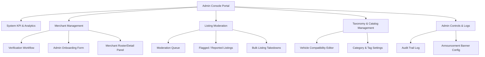
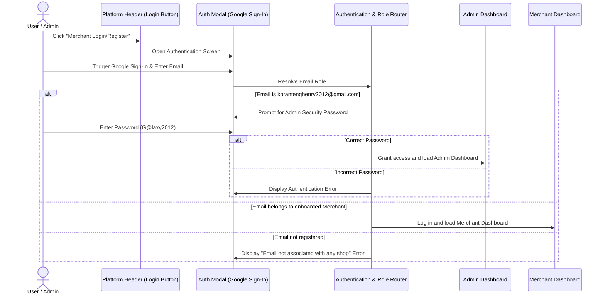

# Product Requirements Document (PRD)
## ABBOSSEY OKAI MAGAZINE — Admin Console

| Attribute | Details |
| :--- | :--- |
| **Document Version** | 1.1.0 |
| **Status** | Approved / Active |
| **Target Release** | Phase 4 (Administrative & Verification Operations) |
| **Author** | Antigravity AI |
| **Last Updated** | July 10, 2026 |

---

## 1. Executive Summary & Vision

### 1.1 Project Background
The **ABBOSSEY OKAI MAGAZINE** platform is a mobile-responsive Progressive Web Application (PWA) serving as an E-Commerce Marketplace for auto parts and accessories in Abossey Okai, Accra. The platform connects consumers directly with local parts dealers and accessory shops, facilitating discovery and driving customer leads directly to merchants via WhatsApp and mapped coordinates.

### 1.2 The Problem
Currently, the platform relies on static front-end configurations and lacks a centralized administrative mechanism for registering and verifying merchants. Operating on self-reported data introduces several risks:
- **Trust Deficit:** Bad actors could register shops with false Abossey Okai stall locations.
- **Data Quality:** Lack of standardization in shop profiles, locations, and initial listing quality.
- **Onboarding Friction:** Busy local merchants in Abossey Okai often lack the time or digital literacy to register themselves online.
- **Hardcoded Taxonomy:** Adding a new car model or parts category requires direct code updates.

### 1.3 The Solution
The **Admin Console** acts as the central administrative hub where administrators manually onboard and verify local merchants. By shifting onboarding from a public self-service wizard to an admin-managed portal, the platform guarantees that every registered merchant is vetted, physically verified, and assigned accurate location coordinates before they can list parts.

---

## 2. User Personas

| Persona | Primary Goal | Key Pain Points |
| :--- | :--- | :--- |
| **Platform Administrator** | Oversees marketplace health, controls global config, registers new moderators, manages tax structures. | Hardcoded data updates, tracking administrative operations. |
| **Stall Moderator (On-the-ground agent)** | Conducts physical verification of Abossey Okai stalls and updates merchant verification status. | Needs mobile access to review coordinates and verify storefronts on the market floor. |
| **Catalog Moderator (Remote content team)** | Audits listing compatibility data, approves listing submissions, resolves user reports. | Sifting through duplicate or incorrect fitment tags efficiently. |

---

## 3. Product Features & Core Components

---

### Component 1: KPI & System Analytics Dashboard
The landing panel of the Admin Console, providing real-time operational diagnostics of the marketplace.

*   **Total Listings Stats:** Summary of `Live`, `Pending Review`, `Hidden`, and `Out of Stock` listings.
*   **Merchant Distribution:** Total registered merchants, categorized by status: `Verified` vs. `Independent` (unverified).
*   **Lead & Engagement Tracking:** Aggregated counts of storefront clicks, WhatsApp link redirections, and Google Map directions.
*   **Moderation Alert Banner:** Quick-action metrics for pending registrations and unresolved user listing flags.
*   **Top Sellers & Popular Parts:** Charts showing most-viewed brands, categories, and shops (populated from data views like `views`).

---

### Component 2: Merchant Management System
Empowers administrators to curate and vet the merchant network operating inside Abossey Okai.

#### A. Admin-Driven Merchant Onboarding Wizard
*   **Functionality:** To ensure high data quality and trust, there is no public merchant registration. Administrators manually onboard merchants via a structured form within the Admin Console.
*   **Admin Actions:**
    *   *Fill Shop Profile:* Input the shop name, description, category tags, contact phone number, and physical stall address.
    *   *Geographic Pinning:* Use an integrated map picker or enter direct coordinates (Latitude/Longitude) to map the merchant's physical stall in Abossey Okai.
    *   *Access Credential Generation:* Auto-generate login credentials (e.g., a simple mobile-friendly passcode or temporary login link) and send it directly to the merchant's WhatsApp.
    *   *Onboard & Activate:* Save profile, set status to `Active`, and toggle the `Verified` badge immediately.

#### B. Verification Workflow
*   **Functionality:** Manage the `verified: true/false` flag displayed as a badge on the storefront and product cards.
*   **Admin Actions:**
    *   Trigger manual or physical verification.
    *   Add notes for verification status (e.g., "Physically checked stall A12, owner Kofi verified on 2026-07-07").
    *   Promote Independent sellers to Verified status or revoke verified badges in case of customer disputes.

#### C. Merchant Roster & Action Drawer
*   **Functionality:** Datatable containing all registered merchants with search (by shop name/phone) and filtering (by verification status, lane/region).
*   **Admin Actions:**
    *   *View Shop Details:* Look up merchant profile metadata and all listed products.
    *   *Suspend Merchant:* Temorarily freezes the shop. Hides all associated listings from the public marketplace grid.
    *   *Blacklist/Ban:* Permanently deactivates merchant credentials, bans their WhatsApp number, and deletes listings.

---

### Component 3: Product Listing & Moderation Center
Protects marketplace integrity by ensuring all published parts are legitimate, categorized properly, and compatible.

#### A. Listing Approval Queue
*   **Functionality:** System config to support either:
    *   *Auto-publish:* Listings go live immediately (current behavior), subject to post-moderation checks.
    *   *Pre-publish moderation:* All listings are held in `Pending Review` until approved by an admin.
*   **Admin Actions:**
    *   *Approve:* Moves listing status to `Live`.
    *   *Reject/Draft:* Returns listing to merchant dashboard with change requests (e.g., "Add clearer photo showing the part number").
    *   *Edit Listing:* Admin overrides incorrect category tags, spelling mistakes, or pricing outliers.

#### B. Flagged & Reported Listings Queue
*   **Functionality:** A queue populated by reports generated from the public PDP's "Report this Listing" link.
*   **Report Categories:**
    *   *Incorrect Compatibility/Fitment:* Consumer reports that the part does not fit the stated vehicle.
    *   *Incorrect Pricing:* Listing price does not match quotes given on WhatsApp.
    *   *Counterfeit/Scam:* Fake parts, stolen photos, or fraudulent behavior.
    *   *Duplicate Listing:* Same part listed multiple times by the same dealer.
*   **Admin Actions:**
    *   *Dismiss Flag:* Clears report history, keeps listing live.
    *   *Warn Seller:* Sends system warning to merchant dashboard.
    *   *Remove Listing:* Immediately changes status to `Hidden`/`Deleted` and archives detail page.

---

### Component 4: Platform Database & Taxonomy Editor
Eliminates code updates by allowing administrators to dynamically extend vehicle fitments and product categories.

#### A. Vehicle Taxonomy Manager
*   **Functionality:** Direct GUI to edit the nested `VEHICLE_TAXONOMY` object.
*   **Admin Actions:**
    *   *Add/Edit/Delete Vehicle Make:* (e.g., Adding "Toyota", "Honda").
    *   *Add/Edit/Delete Vehicle Model:* (e.g., Adding "Corolla" nested under "Toyota").
    *   *Modify Fitment Years:* Append new production years (e.g., adding "2026").

#### B. Category & Brand Settings
*   **Functionality:** Direct GUI to update category definitions.
*   **Admin Actions:**
    *   Add or edit parts categories (e.g., adding "Engine Management" to the `SPARE_PART_CATEGORIES` list).
    *   Add or edit accessories categories (e.g., modifying `CAR_ACCESSORY_CATEGORIES`).
    *   Manage the popular brands autocomplete lookup table (e.g., Akebono, Denso, KYB).

---

### Component 5: Admin System Controls & Security

#### A. Audit Logs (Trail)
*   **Functionality:** An immutable, chronological log tracking admin operations. Stored as a simple JSON array in `localStorage` under `ao_admin_audit_logs`.
*   **Log Data:** Timestamp, Admin Username, Action (e.g. `MERCHANT_ONBOARD`, `LISTING_STATUS_CHANGE`), Target Object ID, and Details.

#### B. Global Announcement Banner Config
*   **Functionality:** Configures the PWA install notice banner in the website header (`index.html`) to act as a dynamic system notice banner.
*   **Admin Actions:** Toggle visibility and edit banner text, persisting state to `ao_global_announcement` in `localStorage`.

---

## 6. Unified Authentication & Role Resolution Flow

To consolidate administration with the main customer-facing platform, the portal combines merchant and admin authentication pathways under a single, unified login portal.

### 6.1 Authentication Specifications

1.  **Access Point:** 
    *   There is no separate URL or subdomain for admin logins (e.g., no separate `/admin`).
    *   Clicking the **"Merchant Login/Register"** button in the main platform navigation navbar triggers the unified authentication modal.

2.  **Role Classification:**
    *   **Administrator Account:**
        *   **Dedicated Email:** `korantenghenry2012@gmail.com`
        *   **Admin Passcode Bypass:** `G@laxy2012`
        *   **Workflow:** When this specific email is entered, the login flow intercepts the default OAuth path and presents a secondary passcode dialog box requiring the user to type in `G@laxy2012`. If successful, the user is navigated directly to the Admin Panel (`#admin-dashboard-panel` / view `admin-dashboard`).
    *   **Merchant Account:**
        *   **Dedicated Email:** Any email matching an entry in the registered merchants roster (`this.merchants`).
        *   **Workflow:** The login flow automatically directs these users to their private self-service dashboard (`#merchant-dashboard-panel` / view `dashboard`).
    *   **Unregistered/Invalid Access:**
        *   Any other email inputs trigger an inline error toast: `"This email is not associated with any onboarded merchant shop. Please contact the Admin."`

---

## 7. Technical Architecture & Data Correlation Map

To prevent over-adding or under-adding features, the Admin Console binds directly to the existing frontend model arrays and states using `localStorage` namespaces.

| Feature Area | Admin Console Component | Correlating Frontend State / Code Symbol | Data Sync Mechanism |
| :--- | :--- | :--- | :--- |
| **KPI & Analytics** | Stats grid showing Total Listings, Total Views, and Most Viewed Product. | `app.products` array | Scans the `products` list in `localStorage`, calculating counts based on `p.status` and calculating sum of `p.views`. |
| **Onboarding** | *Add Merchant* form saving Shop Details (name, phone, location, coordinates, description). | `ao_marketplace_merchants` (new array in `localStorage`) | Creates a merchant profile. Sets initial `verified: false`. When a merchant logs in on the storefront via phone number or Google email, it queries this roster. |
| **Verification** | Toggle verification flag (`verified: true / false`). | `p.merchant.verified` in `app.products` | Updating a merchant’s verification status in the Admin Console traverses the products array and updates `verified` on all products matching that merchant. |
| **Listing Moderation** | Review listings table. Set status to `Live`, `Pending Review`, or `Hidden`. | `p.status` in product objects | Directly modifies `p.status` in the products array. Listings with `status !== "Live"` are automatically filtered out by `app.renderCatalog()` in the client storefront. |
| **Report Processing** | View reported listings. Dismiss report or take down listing. | `ao_reported_listings` (new array in `localStorage`) | Pushing to "Report this Listing" on the PDP (PDP report link) will append the listing ID to this array. Admins can view and clear items in this queue. |
| **Taxonomy Editor** | Manage vehicle makes, models, years, and categories. | `VEHICLE_TAXONOMY` (Constant in [app.js](file:///Users/mac/Documents/abbossey%20okai/js/app.js#L4-L37)) | `app.js` is modified to load `VEHICLE_TAXONOMY` from `localStorage` (`ao_vehicle_taxonomy`) first, falling back to the hardcoded default object. |

---

## 8. UI/UX & Design Guidelines

The Admin Console must retain the core design system tokens of the **ABBOSSEY OKAI MAGAZINE** brand to provide a cohesive internal platform experience.

### 8.1 Theme & Aesthetics
- **Primary Color:** Deep Blue (`#0F4C81`) used for page headers, sidebars, and critical action states.
- **Accent Color:** Orange (`#F97316`) for primary alerts, warning badges, and dashboard metric highlights.
- **Secondary / Neutral Dark:** Charcoal (`#1F2937`) for text, tables, and card structures.
- **Background:** Slate light (`#F8FAFC`) with clean white grids (`#FFFFFF`).
- **Typography:** Google Fonts: *Inter* (Headings: bold 700, Subheadings: semi-bold 600, Tables/Body: regular 400-500).

### 8.2 Layout Architecture
1. **Split-Screen Dashboard Layout:**
   - **Left Navigation Drawer:** A fixed sidebar containing navigation links with icons (Dashboard, Merchants, Listings, Taxonomy, Audit Logs, Settings).
   - **Main Work Canvas:** Dynamic page container with cards, stats grids, and search widgets.
2. **Action Overlay drawers:** Instead of full page reloads, actions (such as viewing merchant details or editing a listing) slide out from the right side of the screen as detailed panels, maintaining user state on the primary table.

---

## 9. Non-Functional Requirements (NFR)

*   **Security:** Access to the admin console requires Multi-Factor Authentication (MFA) simulation or a static admin access passcode bypass. Normal public visitors must be redirected to the storefront if trying to access `/admin`.
*   **Performance:** Tables containing thousands of listings must support pagination and server-side filtering to ensure loading times under **1.5 seconds**.
*   **Mobile Optimizations:** The layout must fold gracefully onto mobile viewports, allowing administrators to moderate listings directly on their smartphones while walking the market floor.
*   **Data Backups:** Automatic daily backups of the merchant inventory and configuration mappings.

---

## 10. Implementation Stages (Phases)

1. **Stage 1 (Core & Read Operations):** Build the Admin UI skeleton, wire the static views, and feed mock listing data into a unified, paginated admin roster table.
2. **Stage 2 (Moderation Actions & Writes):** Implement Listing approvals, takedowns, flag handling, and Merchant verification status overrides.
3. **Stage 3 (Dynamic Taxonomy & Configuration):** Connect the database to support active addition/deletion of Make/Model mappings and categories.
4. **Stage 4 (Audit Logs & Multi-tenant Roles):** Build the audit log viewer and implement Moderator vs. Super Admin permissions.
